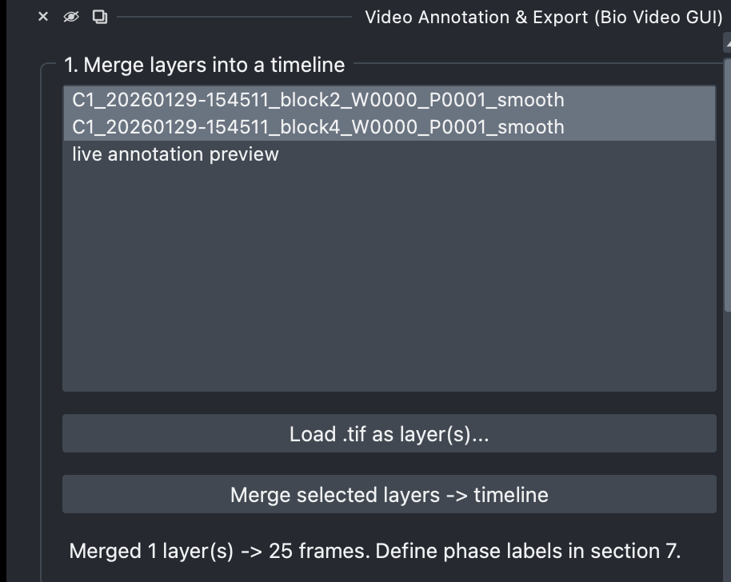

[← Back to tutorial index](tutorial.md)

# 1. Merge layers into a timeline

Combine one or more napari image layers (your loaded `.tif` stacks) into a
single working timeline that the rest of the widget operates on.

## Steps

1. **Load .tif as layer(s)...** — opens a file picker; each selected TIFF is
   added as its own napari image layer. If the TIFF has ImageJ metadata,
   pixel size and frame interval are read automatically into section 2
   (Calibration).
2. Select one or more layers in the list above (order matters — they're
   concatenated in the order selected).
3. Click **Merge selected layers → timeline**. This creates a new working
   stack named `merged timeline`.

  

<!--
SCREENSHOT NEEDED: images/01-merge.png
Section 1 group box with a couple of layers loaded and selected in the
list, and the merge status label showing a completed merge
(e.g. "Merged 2 layer(s) -> 60 frames...").
-->

> Phase labels (naming which frame ranges correspond to which experimental
> phase) are defined **afterwards**, in [section 7](07-phase-annotations.md)
> — merging itself only concatenates frames.
