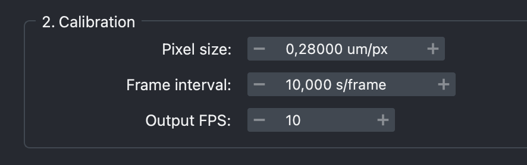

[← Back to tutorial index](tutorial.md)

# 2. Calibration

Sets the physical/temporal scale used everywhere else in the widget (scale
bar length, timestamp values, export frame rate).

| Field | Meaning |
|---|---|
| **Pixel size** (µm/px) | Used to convert the scale bar's physical length into pixels. Auto-filled from TIFF metadata when available. |
| **Frame interval** (s/frame) | Time between frames in the source data. Used to compute the timestamp shown per frame. |
| **Output FPS** | Playback speed of the exported video — independent from the frame interval above (e.g. you can acquire at 1 frame/10s but export at 10 fps for a fast-forward effect). |

  

<!--
SCREENSHOT NEEDED: images/02-calibration.png
Section 2 group box showing the three fields with example values filled in.
-->

If a loaded TIFF has no ImageJ calibration metadata, these fields default to
`1.0`/`1.0`/`10` and must be entered manually.
