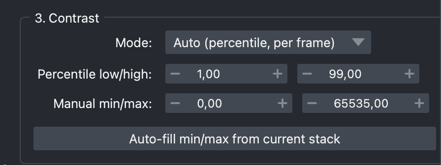

[← Back to tutorial index](tutorial.md)

# 4. Contrast

Controls how raw intensity values are stretched to the displayed 8-bit
range before annotations are drawn.

## Modes

- **Auto (percentile, per frame)** — each frame is stretched independently
  using the **Percentile low/high** values (default 1–99). Good default for
  timelapses where overall brightness drifts.
- **Manual min/max** — a single fixed `(min, max)` intensity range is
  applied to every frame, so brightness stays comparable across the whole
  video. Use **Auto-fill min/max from current stack** to seed reasonable
  values (0.5th/99.5th percentile of the whole stack), then fine-tune.

  

<!--
SCREENSHOT NEEDED: images/03-contrast.png
Section 3 group box, ideally with "Manual min/max" selected and
auto-filled values visible.
-->

Switching modes updates the live preview (section 10) immediately, so it's
easy to compare auto vs. manual on the same frame before committing.
