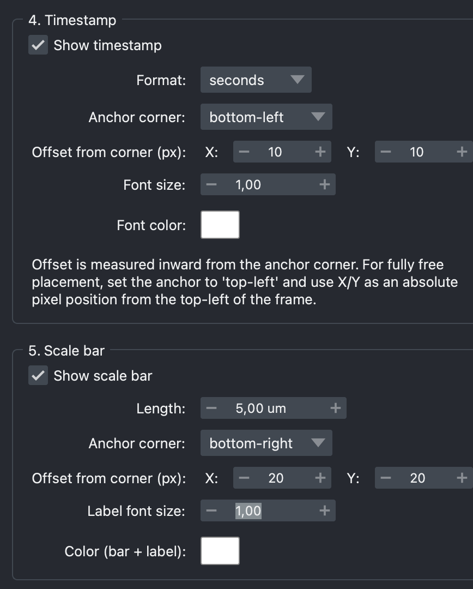

[← Back to tutorial index](tutorial.md)

# 5. Timestamp

Burns a running time label into every frame, computed from the frame index
and the **Frame interval** set in section 2.

| Field | Meaning |
|---|---|
| Show timestamp | Toggle on/off |
| Format | `seconds`, `mm:ss`, or `hh:mm:ss` |
| Anchor corner | Which corner of the frame the label is placed relative to |
| Offset from corner (px) | X/Y distance inward from the anchor corner |
| Font size | Relative scale |
| Font color | Click the swatch to open a color picker |

  

<!--
SCREENSHOT NEEDED: images/04-timestamp.png
Section 4 group box, plus ideally a preview frame showing the timestamp
rendered in a corner of the image.
-->

> For fully free placement, set the anchor to `top-left` and use the X/Y
> offset as an absolute pixel position from the frame's top-left corner.
