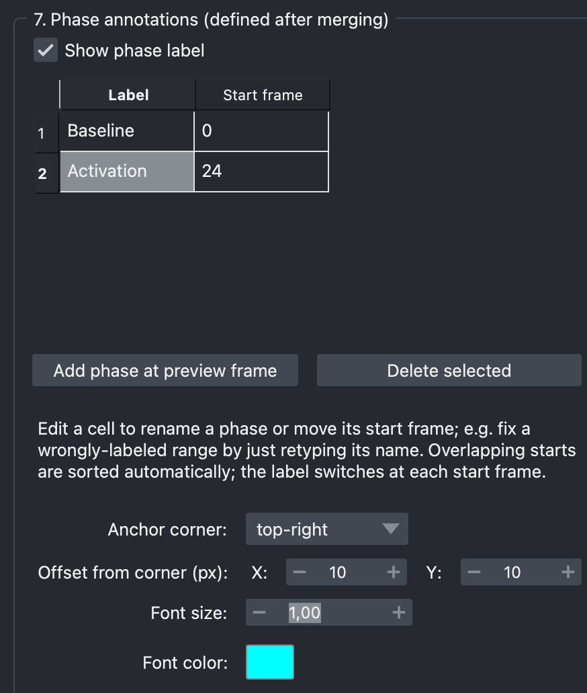
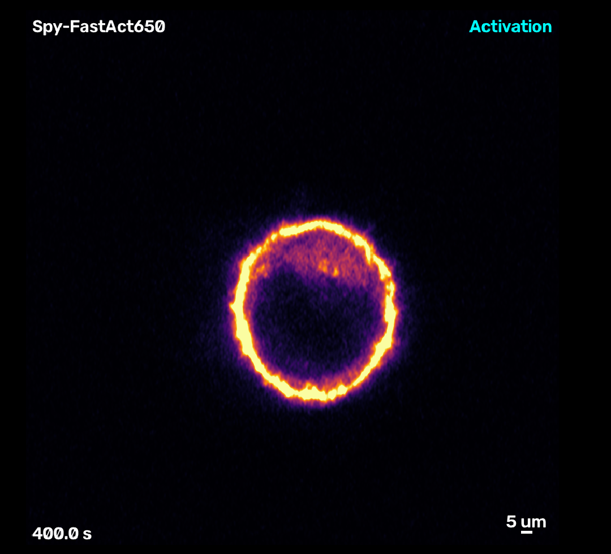

[← Back to tutorial index](tutorial.md)

# 8. Phase annotations (defined after merging)

After merging layers into a timeline (section 1), use this section to label
which frame ranges correspond to which experimental phase (e.g.
"baseline" → "activation").

## Steps

1. Move the **Preview frame** spinner (section 10) to the frame where a new
   phase should start.
2. Click **Add phase at preview frame** — adds a row to the table with a
   default name and that frame as its start.
3. Edit any cell directly to rename a phase or move its start frame —
   just retype the name or number.
4. Select row(s) and click **Delete selected** to remove a phase.

Rows are sorted automatically by start frame; the displayed label switches
at each phase's start frame and holds until the next one.

  

## The video should take form with all the annotations at this point 

  

<!--
SCREENSHOT NEEDED: images/07-phase-table.png
Section 7 group box with 2-3 phase rows defined (e.g. "baseline" at 0,
"activation" at 30).
-->

## Styling

Same pattern as other labels: **Show phase label** toggle, anchor corner,
X/Y offset, font size, font color.
