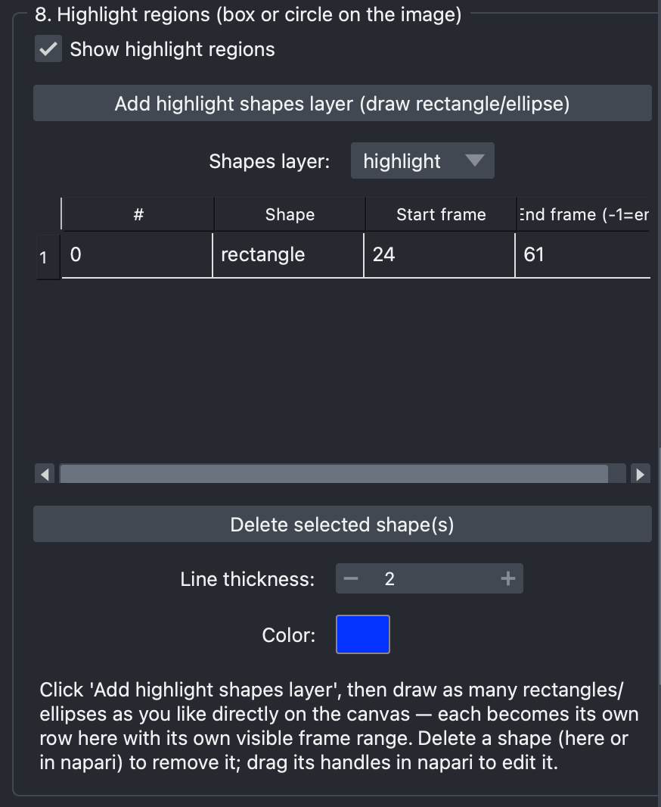

[← Back to tutorial index](tutorial.md)

# 9. Highlight regions (box or circle on the image)

Draw one or more rectangles/circles directly on the image that appear only
during a chosen frame range — e.g. to draw attention to an activated region.

## Steps

1. Click **Add highlight shapes layer (draw rectangle/ellipse)** — adds a
   new napari Shapes layer and switches it into rectangle-drawing mode.
2. Draw as many rectangles/ellipses as you like directly on the canvas —
   each one becomes its own row in the table below, with columns `#`,
   `Shape`, `Start frame`, `End frame (-1=end)`.
3. Edit the start/end frame cells to control when each shape is visible
   (`-1` means "visible until the end of the stack").
4. To edit a shape's position/size, drag its handles directly in napari.
   To remove one, select its row and click **Delete selected shape(s)**
   (or delete it in napari — both stay in sync).

  

<!--
SCREENSHOT NEEDED: images/08-highlight-regions.png
napari canvas with 1-2 highlight shapes drawn, and the section 8 table
showing matching rows with start/end frames set.
-->

## Styling

**Show highlight regions** toggle, plus shared **line thickness** and
**color** applied to all shapes.

> You can have multiple independent shapes layers — use the **Shapes
> layer** dropdown to switch which one section 8 is currently reading from.
